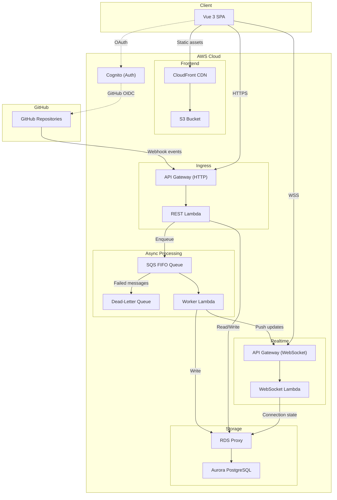

# Architecture Overview

GitGazer is a serverless application built on AWS that monitors GitHub Actions workflows in real time. It receives webhook events from GitHub, processes them asynchronously, stores them in a PostgreSQL database, and pushes live updates to connected clients.

## System Diagram

## Request Flow

1. **Webhook ingress** — GitHub sends webhook events to API Gateway. The REST Lambda validates the HMAC signature and enqueues the event to an SQS FIFO queue.
2. **Async processing** — The Worker Lambda consumes events from SQS, inserts/upserts data into Aurora PostgreSQL, and triggers side effects (WebSocket push, alerting).
3. **Real-time updates** — The Worker pushes workflow updates to connected WebSocket clients via the API Gateway Management API.
4. **Frontend** — The Vue 3 SPA is served from S3 via CloudFront. It communicates with the REST API over HTTPS and receives live updates over WebSocket.
5. **Authentication** — Users sign in via GitHub OAuth through AWS Cognito. Session tokens are stored in httpOnly cookies.

## Monorepo Structure

GitGazer is a **pnpm monorepo** with the following workspaces:

| Workspace          | Purpose                                                            | Tech Stack                                    |
| ------------------ | ------------------------------------------------------------------ | --------------------------------------------- |
| `apps/api/`        | AWS Lambda backend — REST API, WebSocket handler, worker, alerting | TypeScript, Node.js 24, Drizzle ORM           |
| `apps/web/`        | Single-page application frontend                                   | Vue 3, Radix Vue, Tailwind CSS 4, Pinia, Vite |
| `apps/docs/`       | Documentation site (this site)                                     | Docusaurus                                    |
| `packages/db/`     | Shared database schema, types, and client                          | Drizzle ORM, TypeScript                       |
| `packages/import/` | Historical GitHub Actions data backfill utility                    | TypeScript                                    |
| `infra/`           | Infrastructure as code                                             | Terraform, AWS                                |

## Key Technology Choices

### AWS Lambda (Serverless Compute)

All backend logic runs on AWS Lambda — REST API handler, WebSocket handler, webhook worker, and scheduled org sync. This means zero idle cost, automatic scaling, and no server management.

### Aurora PostgreSQL Serverless (Database)

The database is Aurora PostgreSQL Serverless v2 with RDS Proxy for connection pooling. Row-level security (RLS) enforces tenant isolation at the database level — every query runs within a transaction scoped to the user's integrations.

### Drizzle ORM (Database Access)

Drizzle provides type-safe database access with a lightweight footprint suitable for Lambda cold starts. It handles migrations via `drizzle-kit` and generates TypeScript types from the schema.

### Vue 3 + Radix Vue (Frontend)

The SPA uses Vue 3 with the Composition API (`<script setup>` syntax). UI primitives come from Radix Vue for accessibility. Styling uses Tailwind CSS 4. State management uses Pinia.

### Terraform (Infrastructure)

All AWS resources are defined as Terraform HCL files in `infra/`. This enables repeatable deployments, change previews via `terraform plan`, and version-controlled infrastructure.

## Lambda Functions

GitGazer deploys multiple Lambda functions, each with a distinct responsibility:

| Lambda        | Trigger               | Purpose                                                                                        |
| ------------- | --------------------- | ---------------------------------------------------------------------------------------------- |
| **REST API**  | API Gateway HTTP      | Handles all REST API requests (auth, integrations, workflows, notifications, etc.)             |
| **WebSocket** | API Gateway WebSocket | Manages `$connect` and `$disconnect` lifecycle events                                          |
| **Worker**    | SQS event source      | Processes webhook events asynchronously — inserts data, pushes WebSocket updates, sends alerts |
| **Org Sync**  | EventBridge schedule  | Periodically syncs GitHub organization members to integration memberships                      |
