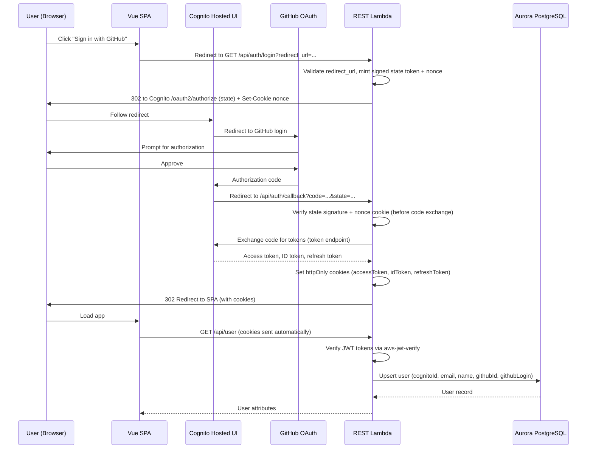

# Authentication & Authorization

GitGazer uses AWS Cognito with GitHub as an OIDC identity provider. Users sign in with their GitHub account, receive session tokens stored in httpOnly cookies, and are authorized based on their role within each integration.

## Authentication Flow



### How It Works

1. The SPA redirects the browser to `GET /api/auth/login?redirect_url=<app-origin>`. Sign-in is initiated **server-side** — the SPA no longer builds the Cognito authorize URL itself.
2. The login endpoint validates the `redirect_url`, mints a **signed, single-use `state` token** bound to a random **nonce**, stores the nonce in a short-lived httpOnly cookie (`oauthStateNonce`, 10-minute TTL), and 302-redirects to Cognito's `/oauth2/authorize` with the signed token in the `state` parameter.
3. Cognito redirects to GitHub for OAuth consent.
4. After approval, Cognito receives an authorization code and redirects to `GET /api/auth/callback?code=...&state=...`.
5. The callback handler **verifies the signed `state` token and nonce cookie before anything else** — checking the HMAC signature, the expiry, and that the nonce embedded in the token matches the nonce cookie. If any check fails it returns HTTP 403 and **never exchanges the code**.
6. Only after the state is verified does the handler exchange the code for tokens via Cognito's token endpoint.
7. Tokens are set as **httpOnly, Secure, SameSite=Lax** cookies, the state cookie is cleared, and the user is redirected back to the validated app URL. All subsequent API requests include cookies automatically.

### OAuth State Binding (Login-CSRF Protection)

The `state` parameter is not just an opaque redirect hint — it is a signed token that protects against login cross-site request forgery (an attacker tricking a victim into completing a login the attacker started).

- **Signed payload** — the token is `base64url(payload).hmacSHA256(payload)`, where the payload carries the `redirect_url`, a random `nonce`, and an `exp` timestamp. It is signed with a dedicated `stateSecret`.
- **Nonce binding** — the same nonce is stored in the httpOnly `oauthStateNonce` cookie. The callback only succeeds if the nonce inside the signed token matches the nonce in the cookie, so a `state` value cannot be replayed in another browser.
- **Constant-time checks** — the signature and nonce are compared in constant time (both sides are SHA-256 hashed first) so neither length nor content leaks through timing.
- **Fail closed** — if `stateSecret` is not configured, login initiation and callback both fail loudly rather than silently accepting forgeable tokens.
- **Short-lived & single-use** — the token expires after 10 minutes (matching the cookie `Max-Age`), and the nonce cookie is cleared once the callback completes.

### GitHub Identity Mapping

Cognito maps GitHub profile attributes to user pool claims:

| GitHub Attribute | Cognito Claim      | Purpose                                    |
| ---------------- | ------------------ | ------------------------------------------ |
| `email`          | `email`            | User email address                         |
| `name`           | `name`             | Display name                               |
| `sub`            | `username`         | Unique GitHub user identifier              |
| `avatar_url`     | `picture`          | Profile picture                            |
| `login`          | `nickname`         | GitHub username                            |
| `id`             | `custom:github_id` | Numeric GitHub user ID (used for org sync) |

## Token Lifecycle

GitGazer manages three tokens, all stored as httpOnly cookies:

| Token             | Purpose                                                        | Lifetime                              |
| ----------------- | -------------------------------------------------------------- | ------------------------------------- |
| **Access token**  | Authorizes API requests. Verified on every request.            | Short-lived (Cognito default: 1 hour) |
| **ID token**      | Contains user identity claims (email, name, github_id).        | Short-lived (matches access token)    |
| **Refresh token** | Used to obtain new access/ID tokens without re-authentication. | Long-lived (Cognito default: 30 days) |

### Silent Refresh

When the access token expires, the SPA's `fetchWithAuth` helper automatically retries:

1. An API request returns HTTP 401.
2. `fetchWithAuth` calls `POST /api/auth/refresh` with the refresh token cookie.
3. The API exchanges the refresh token for new access/ID tokens via Cognito.
4. New cookies are set on the response.
5. The original request is retried with the fresh tokens.

This is transparent to the user — there is no visible re-authentication.

## Middleware Chain

Every API request passes through a global middleware chain in this order:

```
compress → cors → authenticate → originCheck → route handler
```

### 1. Compress

Applies gzip compression to responses.

### 2. CORS

Validates the `Origin` header against a configured allowlist and sets CORS response headers.

### 3. Authenticate

The core authentication middleware:

1. Checks if the route is in the **public route bypass** list. If so, skips authentication.
2. Extracts `accessToken`, `idToken`, and `refreshToken` from cookies.
3. Verifies both the access token and ID token using `aws-jwt-verify` against the Cognito user pool.
4. **Upserts the user** into `gitgazer.users` using claims from the ID token (cognitoId, email, name, picture, githubId, githubLogin).
5. If the user has a `github_id`, resolves any **pending org sync** entries — automatically adding the user to integrations where their GitHub org membership was synced before they first logged in.
6. Attaches user context (`userId`, `username`, `email`, etc.) to the request.

### 4. Origin Check (CSRF Protection)

For state-changing requests (`POST`, `PUT`, `DELETE`, `PATCH`) on non-public routes:

- Checks the `Origin` header against a configured allowlist.
- Rejects requests with an unrecognized origin with HTTP 403.
- Allows requests without an `Origin` header (server-to-server calls where cookies aren't attached).
- Public routes (webhooks, auth callbacks) are exempt because they use their own authentication (HMAC signatures, authorization codes).

## Public Route Bypass

These route prefixes skip authentication because they have their own verification:

| Prefix               | Reason                                                                     |
| -------------------- | -------------------------------------------------------------------------- |
| `/api/auth/callback` | OAuth callback — no cookies yet, uses authorization code                   |
| `/api/auth/refresh`  | Token refresh — uses refresh token cookie directly                         |
| `/api/auth/cognito/` | Cognito OIDC helper endpoints (token proxy, user info proxy)               |
| `/api/import/`       | Integration webhooks — verified via HMAC signature (`X-Hub-Signature-256`) |
| `/api/github/`       | GitHub App webhooks — verified via app-level HMAC signature                |

Each domain declares its own `publicPrefixes` export, which are aggregated into a central registry.

### Cognito OAuth Token Relay

The `/api/auth/cognito/` prefix backs a relay that Cognito itself calls to complete the GitHub identity-provider exchange. Because Cognito is the caller, these routes cannot sit behind the normal Cognito authorizer — so they enforce their own checks:

- **Caller authentication** — `POST /api/auth/cognito/token` authenticates its caller against the GitHub OAuth app credentials (`client_id` / `client_secret`) using constant-time comparison. An attacker holding only an intercepted authorization `code` cannot drive the exchange without also holding the OAuth app secret.
- **Server-held credentials only** — the upstream exchange with GitHub always uses the server-configured OAuth app credentials. Caller-supplied client secrets are used solely to authenticate the caller and are **never forwarded** to GitHub.
- **No upstream error reflection** — invalid, expired, or already-used codes surface as a generic HTTP 400, and upstream error text is logged server-side only, never returned to the caller.
- **Fail closed** — if the GitHub OAuth app credentials are not configured, the endpoint returns a server error instead of authenticating a caller with empty credentials.

## Role-Based Access Control (RBAC)

### Role Hierarchy

Every user's membership in an integration has a role. Roles form a strict linear hierarchy where higher roles inherit all permissions of lower roles:

```
owner > admin > member > viewer
```

| Role       | Description                                                                               |
| ---------- | ----------------------------------------------------------------------------------------- |
| **owner**  | Full control including destructive operations. One per integration (the creator).         |
| **admin**  | Full management except integration deletion and ownership transfer.                       |
| **member** | Day-to-day operational access. Can create/edit notification rules. Cannot manage members. |
| **viewer** | Read-only access to all data within the integration scope.                                |

### Permission Matrix

#### Integration Management

| Operation                          | Minimum Role                           |
| ---------------------------------- | -------------------------------------- |
| List integrations                  | viewer                                 |
| Create integration                 | Any authenticated user (becomes owner) |
| Rename integration                 | admin                                  |
| Delete integration                 | owner                                  |
| Rotate webhook secret              | admin                                  |
| Link/unlink GitHub App             | admin                                  |
| Update webhook event subscriptions | admin                                  |

#### Members & Invitations

| Operation                           | Minimum Role              |
| ----------------------------------- | ------------------------- |
| List members / invitations          | viewer                    |
| Change member role                  | admin                     |
| Remove member                       | admin                     |
| Create / resend / revoke invitation | admin                     |
| Accept invitation                   | Any authenticated user    |
| Leave integration                   | Any member (except owner) |

:::info[Additional constraints]

- An **admin** cannot change another admin's role or remove them — only the **owner** can manage admins.
- An **admin** cannot invite someone with the **owner** role.
- The **owner** cannot be removed from an integration.
  :::

#### Notification Rules

| Operation                                  | Minimum Role |
| ------------------------------------------ | ------------ |
| List notification rules                    | viewer       |
| Create / update / delete notification rule | member       |

#### Monitoring & Analytics

| Operation                                    | Minimum Role |
| -------------------------------------------- | ------------ |
| View workflows, overview, metrics, event log | viewer       |
| Toggle event log read status                 | viewer       |

### `requireRole` Middleware

Route handlers that need RBAC protection use the `requireRole` middleware, which:

1. Extracts the `integrationId` from the route parameters.
2. Looks up the user's role for that integration.
3. Compares the user's role against the required minimum role using the hierarchy.
4. Returns HTTP 403 if the user's role is insufficient.

## WebSocket Authentication

WebSocket connections use a signed token instead of cookies (API Gateway WebSocket doesn't forward cookies on `$connect`):

1. The SPA calls `GET /api/auth/ws-token` (authenticated via cookies).
2. The API generates a short-lived (60-second) HMAC-signed token containing `userId`, `integrations`, a random `nonce`, and an expiry timestamp.
3. The SPA connects to the WebSocket API with `?token=<signed-token>&channel=workflows`.
4. The WebSocket Lambda validates the HMAC signature using a **constant-time comparison** (with a length check, since `timingSafeEqual` requires equal-length buffers), checks expiry, and stores one connection record per integration in `gitgazer.ws_connections`.
5. On `$disconnect`, the Lambda removes the connection records.

This ensures WebSocket access is scoped to the same integrations the user has access to via the REST API.
