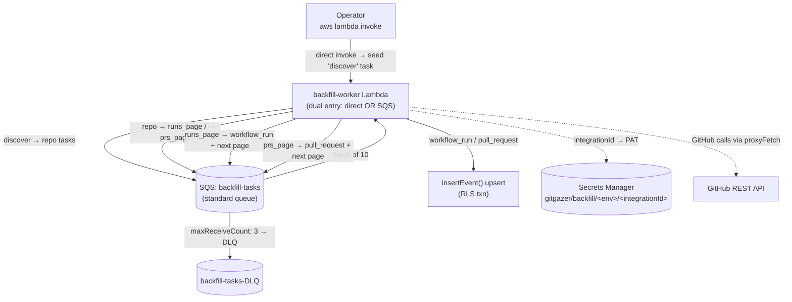
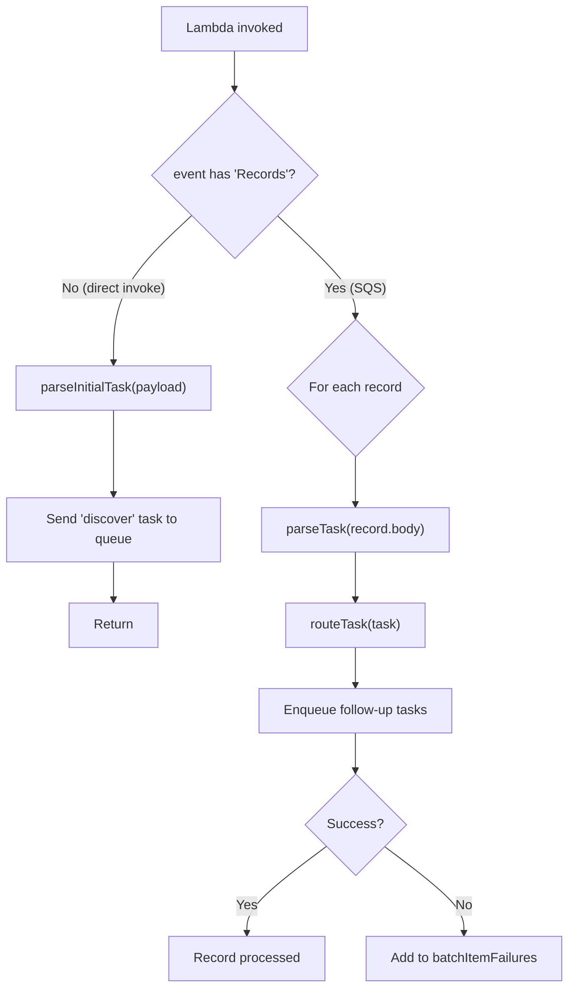
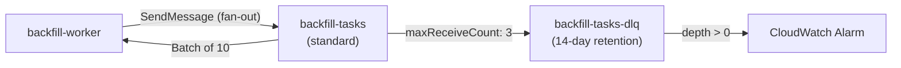
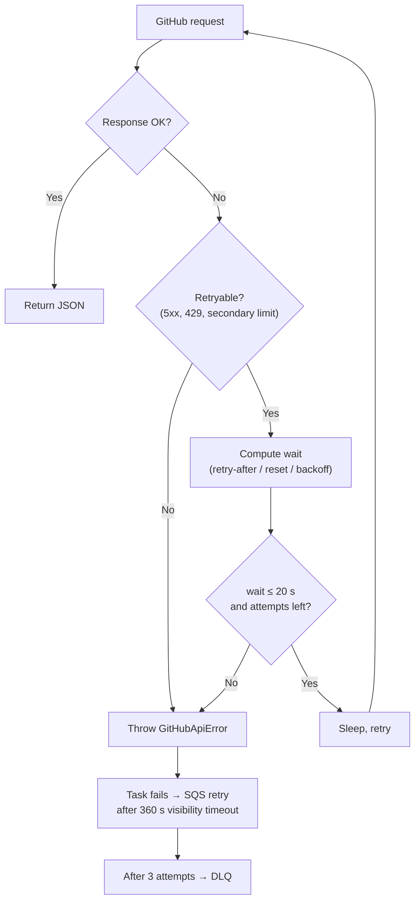

# Backfill Pipeline

GitGazer only sees workflow and pull-request activity that happens **after** a webhook is configured. The backfill pipeline fills the gap by importing historical data straight from the GitHub REST API — entirely inside AWS, with no long-running process tied to an operator's laptop.

It reuses the same ingestion path as live webhooks: every backfilled record flows through `insertEvent()`, so the database upserts, freshness guards, and tenant isolation behave identically to real-time events.

:::info[Looking for how to run it?]
This page explains how the pipeline works internally. To trigger an import, see the [Backfilling Historical Data](../user-guide/backfill.md) user guide.
:::

## Why serverless

The original backfill was a CLI (`packages/import`) that ran on a developer's machine. A dropped VPN, a closed laptop, or a sleeping host would interrupt a multi-hour import. The serverless design eliminates that fragility:

- Work is split into thousands of tiny tasks, each processing **at most one API page or one entity**.
- Every task retries independently through SQS, so a transient failure never restarts the whole run.
- A run resumes automatically — there is nothing to keep online.

## High-Level Flow

## One Lambda, Two Entry Modes

A single `backfill-worker` Lambda handles both how a run **starts** and how it **progresses**. The `handler` inspects the incoming event: an SQS event carries a `Records` array, anything else is a direct invoke.

- **Direct invoke** — The JSON payload is validated as the initial `discover` task and pushed onto the queue. This is how an operator kicks off a run. The function returns immediately.
- **SQS invoke** — Each record is a task, processed with `function_response_types = ["ReportBatchItemFailures"]` (the same partial-batch-failure contract as the webhook [worker](./webhook-pipeline.md)). Follow-up tasks are self-enqueued for fan-out. Failed tasks are retried by SQS, then parked in the DLQ.

This keeps the footprint to **one Lambda + one queue + one DLQ**, which suits a manually triggered, one-off workflow.

## Task Contract

Tasks are JSON bodies on the queue, modeled as a discriminated union (mirroring the existing `WebhookMessage | OrgMemberSyncTask` routing). The `kind` field selects the handler, and each handler returns zero or more follow-up tasks that the worker enqueues.

| Task `kind`       | Work performed                                                 | Fan-out it emits                                                          |
| ----------------- | -------------------------------------------------------------- | ------------------------------------------------------------------------- |
| `discover`        | List repos for `owner` (or a single `repo`, or a topic filter) | one `repo` task per repository                                            |
| `repo`            | Seed pagination for one repository                             | `runs_page{page:1}` and/or `prs_page{page:1}`                             |
| `runs_page{page}` | Fetch **one** page of workflow runs                            | a `workflow_run` task per run + `runs_page{page+1}` if the page is full   |
| `prs_page{page}`  | Fetch **one** page of pull requests                            | a `pull_request` task per in-range PR + `prs_page{page+1}` if more remain |
| `workflow_run`    | Fetch the run + its jobs, transform, ingest                    | _(none — writes to the database)_                                         |
| `pull_request`    | Fetch the PR detail + reviews, transform, ingest               | _(none — writes to the database)_                                         |

Every task carries the run context: `integrationId`, `owner`, `eventTypes`, and optional `since` / `until` date bounds.

### Why chained pagination

Because each task handles at most one page or one entity, **no single invocation can run long enough to hit the 60-second Lambda timeout**. The work naturally spreads across many short invocations, each independently retryable. This is what makes a run resilient and resumable.

### Per-entity tasks carry only IDs

A `workflow_run` task contains just `{ repo, runId }`, not the full run payload. The handler re-fetches the run, its jobs, and the full repository object at processing time. This keeps SQS messages tiny (well under the 256 KB limit) and lets the repository fetch be **cached per container** across tasks for the same repo.

### Event-type filtering

The `eventTypes` array flows through every task. Handlers use it to skip work the operator didn't ask for:

- `repo` only seeds `runs_page` if `workflow_run` or `workflow_job` is requested, and only seeds `prs_page` if `pull_request` or `pull_request_review` is requested.
- `workflow_run` skips the jobs fetch unless `workflow_job` is requested.
- `pull_request` skips the reviews fetch unless `pull_request_review` is requested.

### Date windowing

`since` / `until` (each `YYYY-MM-DD`) bound the import:

- **Workflow runs** use GitHub's server-side `created` query filter (`since..until`, `>=since`, or `<=until`).
- **Pull requests** are listed newest-first by `updated_at` and filtered client-side. Because the list is descending, once the oldest PR on a page predates `since`, pagination stops early — no later page can contain in-range PRs.
- GitHub exposes at most **1,000 runs** per workflow-runs query (`GITHUB_RUNS_RESULT_CAP`). `runs_page` stops paginating at that ceiling and logs a warning when `total_count` exceeds it, so any runs beyond the first 1,000 in a window are skipped — narrowing `since` / `until` is the way to reach them.

## SQS Queue Architecture

### Standard, not FIFO

The backfill queue is a **standard** queue — backfill needs parallelism, not ordering. The upsert freshness guards make duplicate and out-of-order delivery safe, so there's no reason to pay FIFO's throughput cost.

| Property           | Value                              |
| ------------------ | ---------------------------------- |
| Type               | Standard                           |
| Visibility timeout | 360 s (6× the 60 s Lambda timeout) |
| Message retention  | 4 days                             |
| Max message size   | 256 KB                             |
| Polling            | Long polling (5 second wait)       |
| Encryption         | KMS                                |
| Redrive            | `maxReceiveCount: 3` → DLQ         |

### Dead-Letter Queue

A task that fails three times is moved to the DLQ, which retains messages for **14 days**. DLQ depth is the canonical "something went wrong" signal for a run — a CloudWatch alarm fires whenever any message lands there (when alarm notifications are enabled).

### Concurrency cap

The event-source mapping sets `scaling_config { maximum_concurrency = N }` (the `backfill_max_concurrency` variable, default **5**). This bounds how many workers call GitHub in parallel, keeping the fan-out from tripping GitHub's secondary rate limits.

## GitHub Authentication

Backfill authenticates as a **personal access token (PAT) per integration**, not via the GitHub App — not every integration is guaranteed to have an App installation.

- Each PAT lives in its own Secrets Manager secret named `<prefix>/<integrationId>`, where the prefix is `gitgazer/backfill/<workspace>` (for example `gitgazer/backfill/default`). Namespacing by Terraform workspace prevents cross-environment collisions.
- `resolvePat(integrationId)` reads the secret as a **raw string** (not JSON), trims it, and **caches it for the container lifetime** to avoid a Secrets Manager call per task.
- IAM is scoped to the prefix `gitgazer/backfill/<workspace>/*` for least privilege.

## Network Egress

The worker runs in the VPC private subnets for RDS access, where GitHub (IPv4-only) is unreachable directly. All GitHub calls therefore go through the shared `proxyFetch` → HTTP proxy Lambda path — the same route the org-sync worker uses.

## Rate-Limit Handling

`proxyFetch` performs **no** retries when the proxy is enabled, so the backfill GitHub client (`fetchJson`) implements its own bounded retry, and SQS provides the outer safety net.

The wait time is chosen in priority order:

1. The `retry-after` header (seconds), if present — GitHub sends this for secondary/abuse limits.
2. `x-ratelimit-remaining: 0` plus `x-ratelimit-reset` → wait until the reset epoch (plus a 1 s buffer).
3. Otherwise exponential backoff: `min(8 s, 500 ms · 2^(attempt-1))` with up to 30% jitter.

Inline retries happen only when the wait is **≤ 20 seconds** and within the 4-attempt budget. A longer wait (a primary-limit reset can be many minutes out) instead **throws**, failing the task so SQS re-delivers it after the 360-second visibility timeout — no Lambda compute is burned waiting.

## Idempotency & Safety

Re-running a backfill, or retrying any individual task, is safe. Ingestion goes through the same `insertEvent()` path as live webhooks, whose upserts apply freshness guards (`upsertWorkflowRuns` / `upsertWorkflowJobs` return `stale=true` rather than overwriting newer rows). Duplicate and out-of-order arrivals are therefore harmless — which is exactly what lets the queue be standard and the concurrency be parallel.

:::warning[Storage growth in the `events` backup table]
Alongside the deduplicated domain tables, `insertEvent()` appends every record to the append-only `events` backup table, which has **no dedup or freshness guard**. A backfill writes one `events` row per workflow run, job, pull request, and review it processes — and **re-running an overlapping range appends those rows again**. Large or repeated imports can grow this table substantially. Budget RDS storage accordingly, and prune `events` on a retention schedule if you don't need it for replay.
:::

## IAM & Permissions

The worker's execution role grants the minimum it needs:

| Permission                                                                    | Why                                                   |
| ----------------------------------------------------------------------------- | ----------------------------------------------------- |
| `sqs:ReceiveMessage` / `DeleteMessage` / `GetQueueAttributes` / `SendMessage` | Consume tasks and self-enqueue fan-out                |
| `secretsmanager:GetSecretValue`                                               | Read DB config + per-integration PATs (prefix-scoped) |
| `kms:Decrypt` / `GenerateDataKey` / `Encrypt`                                 | Decrypt secrets and queue messages                    |
| `rds-db:connect`                                                              | IAM-auth database connection                          |
| VPC access + CloudWatch Logs                                                  | Run in-VPC and emit structured logs                   |

Notably **absent**: any WebSocket or alerting permissions. Backfill writes straight to the database and skips those live side effects by design.

## Monitoring

- **CloudWatch Logs** — The worker logs structured JSON (AWS Powertools Logger) to a dedicated log group with 30-day retention.
- **DLQ alarm** — Fires when any task exhausts its retries and lands in the dead-letter queue.
- **Queue depth** — `ApproximateNumberOfMessages` + `ApproximateNumberOfMessagesNotVisible` on the backfill queue both reaching zero indicates a run has finished.
- **Lambda duration alarm** — The `backfill-worker` is registered in the standard monitored-Lambda alarm set.
