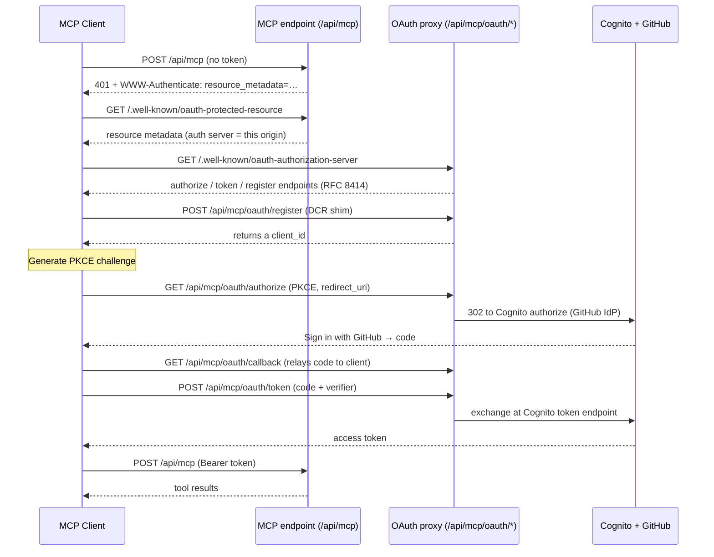

# MCP Server

GitGazer exposes a remote **[Model Context Protocol](https://modelcontextprotocol.io) (MCP)** server so AI assistants — VS Code Copilot, Claude Code, Claude Desktop, Cursor, and any other MCP client — can query a tenant's GitHub Actions data on the user's behalf.

It is **read-only**, authenticated with **OAuth 2.1**, and every query is bounded by the querying user's PostgreSQL role permissions, row-level security, and a usage budget. There is nothing to install: it is served by the existing REST API Lambda as a new `mcp` domain.

For the end-user walkthrough (how to connect a client), see [Querying Data with AI Assistants](../user-guide/ai-assistants.md).

## Endpoint & transport

| Property         | Value                                                   |
| ---------------- | ------------------------------------------------------- |
| Endpoint         | `POST https://<your-gitgazer-domain>/api/mcp`           |
| Transport        | Streamable HTTP (JSON responses, stateless)             |
| Protocol version | `2026-07-28`, and `2025-11-25` for older clients        |
| Auth             | OAuth 2.1 Bearer access token (`Authorization: Bearer`) |

`<your-gitgazer-domain>` is the same host as the GitGazer web app (the CloudFront/custom domain).

The server is **dual-era**: revision `2026-07-28` removed the `initialize` handshake and moved the
protocol version into per-request `_meta`, so which era a request belongs to is decided per request.

- A request carrying `_meta["io.modelcontextprotocol/protocolVersion"]` is served as `2026-07-28`.
  It must also mirror `MCP-Protocol-Version`, `Mcp-Method` and (for `tools/call`) `Mcp-Name` into
  HTTP headers; a mismatch is rejected with `400` and JSON-RPC error `-32020`. An unsupported
  version returns `400` and `-32022` listing the versions the server does support, and an unknown
  method returns `404` and `-32601`.
- Any other request is served as `2025-11-25`: `initialize` and `ping` remain available, and every
  JSON-RPC message — including errors — is returned with HTTP `200`.

`server/discover` is answered in both eras and reports the supported versions, capabilities and
server identity in a single call.

## Authentication

The server is an OAuth 2.1 **Resource Server**, but Cognito on its own does not implement Dynamic Client Registration (RFC 7591), which MCP clients rely on for zero-configuration sign-in. To bridge that, GitGazer ships a small **OAuth authorization-server proxy** in front of Cognito. Clients discover it automatically and connect **without any manual client-ID entry**.

:::note
RFC 7591 Dynamic Client Registration is deprecated as of MCP `2026-07-28` in favour of Client ID
Metadata Documents. The registration shim below still works and remains supported for clients that
rely on it.
:::



Key points:

- **Discovery** follows the MCP spec: RFC 9728 Protected Resource Metadata → RFC 8414 Authorization Server Metadata → registration.
- The proxy is **stateless** — the client's `redirect_uri` and `state` are HMAC-signed into the Cognito `state` parameter, so no server-side session store is needed.
- **PKCE (S256)** is required; the MCP Cognito app client is a public client with no secret.
- The access token's audience is validated against the MCP (and web) Cognito client IDs. The token's `sub` is resolved to a GitGazer user, and the user's integrations become the tenant scope for every query.
- **Redirect allowlist**: the proxy only relays authorization codes to native-app loopback (`127.0.0.1`/`localhost`) and an operator-configurable set of hosted redirect hosts (default `vscode.dev`, `claude.ai`). This is the open-redirect guard — see [Configuration](#configuration).

## Tools

All tools are read-only and run under the `gitgazer_mcp` PostgreSQL role, scoped by row-level security to the caller's integrations.

| Tool                | Input       | Description                                        | Counts against budget |
| ------------------- | ----------- | -------------------------------------------------- | --------------------- |
| `run_sql`           | `{ sql }`   | Run a single read-only `SELECT` / `WITH … SELECT`. | ✅ yes                |
| `list_tables`       | —           | List the tables you may query (schema + name).     | ❌ no                 |
| `describe_table`    | `{ table }` | List a table's columns (name, type, nullability).  | ❌ no                 |
| `list_integrations` | —           | List the integrations (tenants) you can access.    | ❌ no                 |

`run_sql` returns the columns, rows, a `rowCount`, a `truncated` flag, and the query-time `budget` (see [Limits](#limits-and-budget)).

## Queryable data

Queries run against the `github` schema. Because no default `search_path` is set for the role, **tables must be schema-qualified** (`github.workflow_runs`, not `workflow_runs`).

| Table                               | Notes                                                          |
| ----------------------------------- | -------------------------------------------------------------- |
| `github.workflow_runs`              | GitHub Actions runs (`conclusion`, `status`, `created_at`, …). |
| `github.workflow_jobs`              | Jobs within runs.                                              |
| `github.workflow_run_pull_requests` | Join table between runs and pull requests.                     |
| `github.pull_requests`              | Pull requests.                                                 |
| `github.repositories`               | Repositories.                                                  |
| `github.organizations`              | Organizations.                                                 |
| `github.enterprises`                | Enterprises.                                                   |
| `github."user"`                     | GitHub users/actors. `user` is a reserved word — **quote it**. |
| `github.integrations`               | Column-scoped: only `integration_id`, `label`, `created_at`.   |

Not exposed: the `integrations.secret` webhook secret (revoked at the column level), the `gitgazer` application/PII schema (users, invitations, WebSocket connections, notification rules), and `github.pull_request_reviews`.

Example — failing runs per repository over the last week:

```sql
SELECT r.name AS repository, count(*) AS failures
FROM github.workflow_runs wr
JOIN github.repositories r
  ON r.integration_id = wr.integration_id AND r.id = wr.repository_id
WHERE wr.conclusion = 'failure'
  AND wr.created_at > now() - interval '7 days'
GROUP BY r.name
ORDER BY failures DESC
LIMIT 10;
```

Use `list_tables` and `describe_table` to discover the exact columns before writing a query.

## Security model

The raw-SQL path is defended in layers, so a crafted query cannot escape the caller's tenant or read data it was never granted:

1. **OAuth-validated identity** — a valid Cognito access token is required; the `sub` resolves to a GitGazer user and their integrations.
2. **Role GRANTs** — queries run as `gitgazer_mcp` (`NOINHERIT`, not a superuser or table owner). Its `GRANT SELECT` list _is_ the allowlist of readable tables and columns.
3. **Row-level security** — every exposed table carries a tenant policy keyed on `rls.integration_ids`; you only see rows for integrations you belong to.
4. **Read-only transaction** — `SET TRANSACTION READ ONLY`; no writes or DDL.
5. **Single-statement structural guard** — the query is wrapped as `SELECT * FROM (<your sql>) _mcp LIMIT <cap+1>`, which structurally forbids statement stacking and non-`SELECT` statements.
6. **Blocked-function + escape guard** — `set_config`, `pg_sleep`, `pg_stat_activity`, file/host functions, and SQL-standard Unicode-escape syntax (`U&"…"`) are rejected, so the `rls.integration_ids` GUC cannot be overwritten mid-query.
7. **`set_config` REVOKE** — migration `0056` additionally attempts to revoke `EXECUTE` on `set_config` (best-effort; may be a no-op on managed PostgreSQL, which is why layer 6 is the authoritative control).
8. **Resource caps** — a `statement_timeout` and a row cap bound each query.
9. **Per-user budget** — a rolling-window, query-time budget bounds how much `run_sql` execution time a user gets.

## Limits and budget

| Limit             | Default                | Applies to         |
| ----------------- | ---------------------- | ------------------ |
| Row cap           | 1000 rows              | every `run_sql`    |
| Statement timeout | 20 seconds             | every `run_sql`    |
| Query budget      | 600 query-seconds/hour | `run_sql` per user |

When more rows exist than the cap, results are truncated to the cap and `truncated: true` is returned.

Each `run_sql` costs the duration of the query. Every `run_sql` result includes the query-time budget (all values in **seconds**):

```json
{
    "budget": {"limit": 600, "consumed": 12.481, "remaining": 587.519, "resetAt": "2026-07-21T15:00:00.000Z"}
}
```

A query is charged whether it succeeds or fails (including hitting the statement timeout), so expensive queries can't run for free. The window is a rolling `windowSeconds` (default 1 hour) that starts on a user's first query and resets once it elapses; exceeding the budget returns a tool error until then. The discovery tools (`list_tables`, `describe_table`, `list_integrations`) do not consume budget.

## Configuration

Application settings (convict; loaded from Secrets Manager, overridable by env var):

| Setting                    | Env var                          | Default                | Purpose                                                   |
| -------------------------- | -------------------------------- | ---------------------- | --------------------------------------------------------- |
| `mcpServerUrl`             | `MCP_SERVER_URL`                 | derived from domain    | Public MCP URL advertised in OAuth metadata.              |
| `mcpQuota.budgetSeconds`   | `MCP_QUERY_BUDGET_SECONDS`       | `600`                  | Query-time budget per window, per user (in seconds).      |
| `mcpQuota.windowSeconds`   | `MCP_QUERY_QUOTA_WINDOW_SECONDS` | `3600`                 | Budget window length, in seconds.                         |
| `mcpQuota.maxQuerySeconds` | `MCP_QUERY_MAX_SECONDS`          | `20`                   | Max duration of a single `run_sql` (statement timeout).   |
| `mcpAllowedRedirectHosts`  | `MCP_ALLOWED_REDIRECT_HOSTS`     | `vscode.dev,claude.ai` | Hosted OAuth redirect hosts (loopback is always allowed). |

Infrastructure (Terraform):

- `var.mcp_allowed_redirect_hosts` — feeds `mcpAllowedRedirectHosts`; add a client's hosted callback host here to onboard it without a code change.
- `var.mcp_throttling` — edge throttle on `POST /api/mcp` (default 20 req/s, burst 40).
- `aws_cognito_user_pool_client.mcp` — the public PKCE client; its ID is plumbed to the Lambda via Secrets Manager and handed to clients by the `/register` endpoint (no manual paste needed).

Database (Drizzle migrations):

- `0053` — creates the `gitgazer_mcp` role and per-table tenant policies.
- `0054` — grants `SELECT` on the nine exposed relations (column-scoped for `integrations`).
- `0055` — the `mcp_query_usage` quota table.
- `0056` — best-effort `REVOKE EXECUTE` on `set_config`.

## Related

- [Querying Data with AI Assistants](../user-guide/ai-assistants.md) — connect a client and start asking questions.
- [Authentication & Authorization](./authentication.md) — the underlying Cognito + GitHub OAuth model.
