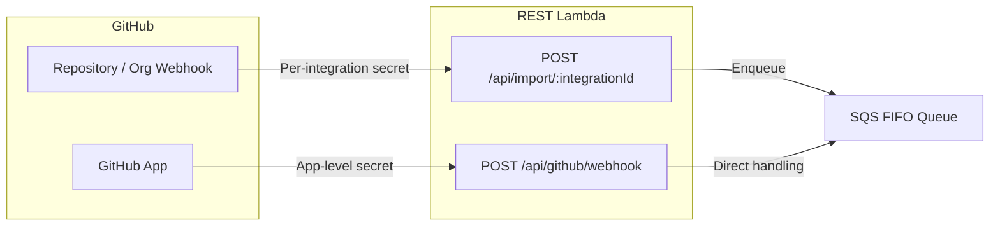
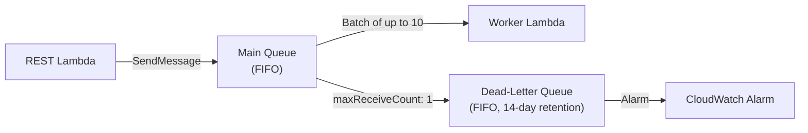
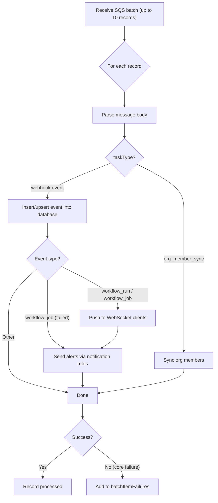

# Webhook Processing Pipeline

GitGazer receives GitHub webhook events, verifies their authenticity, and processes them asynchronously through an SQS queue. This decouples the webhook response from event processing — GitHub gets a fast 200 response while the heavy lifting happens in a worker Lambda.

## Two Ingress Paths

GitGazer supports two ways to receive webhook events from GitHub:

### 1. Integration Webhooks

**Endpoint**: `POST /api/import/:integrationId`

This is the primary path for receiving workflow events. Each integration has its own webhook URL and HMAC secret.

**Request flow**:

1. GitHub sends a webhook with `X-Hub-Signature-256` and `X-GitHub-Event` headers.
2. The `verifyGithubSign` middleware:
    - Looks up the integration's secret from the database (scoped by `integrationId` via RLS).
    - Computes `HMAC-SHA256` of the request body with the integration secret.
    - Compares it to the `X-Hub-Signature-256` header using `crypto.timingSafeEqual` (prevents timing attacks).
3. The route handler validates the `X-GitHub-Event` header against supported event types.
4. The event is enqueued to SQS for async processing.
5. GitHub receives `{"message": "ok"}` immediately.

:::info[Ping events]
GitHub sends a `ping` event when a webhook is first created. This is handled inline (returns `{"message": "ok"}`) without enqueuing to SQS.
:::

### 2. GitHub App Webhooks

**Endpoint**: `POST /api/github/webhook`

This path handles events from the GitGazer GitHub App installation lifecycle (e.g., app installed, app uninstalled, org member changes).

**Request flow**:

1. GitHub sends a webhook signed with the app-level secret.
2. The `verifyGithubAppSignature` middleware validates the signature using the global GitHub App webhook secret (from Secrets Manager).
3. The handler validates the event type against supported GitHub App events.
4. Events are dispatched to the app event handler for processing.

## SQS Queue Architecture

### Main Queue

| Property            | Value                                  |
| ------------------- | -------------------------------------- |
| Type                | FIFO                                   |
| Deduplication scope | Per message group ID                   |
| Throughput limit    | Per message group ID (high throughput) |
| Visibility timeout  | 1.5× Worker Lambda timeout             |
| Message retention   | 1 day                                  |
| Max message size    | 1 MB                                   |
| Polling             | Long polling (5 second wait)           |
| Encryption          | KMS                                    |

The queue uses **message group IDs** to maintain ordering within an integration while allowing parallel processing across integrations.

### Dead-Letter Queue

Messages that fail processing are moved to the DLQ after **1 retry** (`maxReceiveCount: 1`). The DLQ retains messages for **14 days** to allow investigation. A CloudWatch alarm fires when any message lands in the DLQ.

## Worker Lambda

The Worker Lambda is triggered by an SQS event source mapping with a batch size of 10. It uses **partial batch failure reporting** — if some records in a batch fail, only those records are retried (not the entire batch).

### Processing Pipeline

### Step-by-step

1. **Parse** — The SQS record body is parsed as JSON. Messages are either webhook events or org member sync tasks.

2. **Route by task type** — If the message has `taskType: 'org_member_sync'`, it delegates to the org member sync handler. Otherwise, it processes as a webhook event.

3. **Insert event** — The webhook event is inserted or upserted into the database. The importer handles deduplication — stale events (older than what's already in the database) are detected and skipped.

4. **Post-commit side effects** — After the database write succeeds:
    - **WebSocket push**: For `workflow_run` and `workflow_job` events that aren't stale, the worker pushes the updated data to all connected WebSocket clients for that integration.
    - **Alerting**: For `workflow_job` events, the worker checks notification rules and sends alerts for completed failures.

5. **Report failures** — The handler returns `batchItemFailures` containing the message IDs of any records that failed core processing. SQS retries only those records.

### Error Handling

The pipeline separates **core processing** from **side effects**:

- **Core processing failures** (parse errors, database write failures) cause the record's message ID to be added to `batchItemFailures`. SQS retries the message, and after `maxReceiveCount` failures, it moves to the DLQ.

- **Side-effect failures** (WebSocket push errors, alerting errors) are caught, logged with a warning, and **not retried**. The event data is already persisted — the side effect can be manually remediated if needed.

This design ensures that a transient WebSocket connection error or notification delivery failure never causes duplicate event processing.

## Supported Event Types

### Integration Webhooks

| GitHub Event          | What GitGazer Does                                                             |
| --------------------- | ------------------------------------------------------------------------------ |
| `workflow_run`        | Upserts workflow run data (status, conclusion, timing, metadata)               |
| `workflow_job`        | Upserts job data (steps, timing, runner info). Triggers alerting for failures. |
| `pull_request`        | Upserts pull request data (title, state, author, labels)                       |
| `pull_request_review` | Upserts review data (state, author, body)                                      |
| `ping`                | Returns OK (webhook health check, not enqueued)                                |

### GitHub App Webhooks

| GitHub Event   | What GitGazer Does                                             |
| -------------- | -------------------------------------------------------------- |
| `installation` | Tracks GitHub App installation/uninstallation on orgs/accounts |
| `organization` | Handles member added/removed events for org member sync        |

## Monitoring

- **CloudWatch Logs** — The Worker Lambda logs to a dedicated CloudWatch log group with 30-day retention. Logs are structured JSON via AWS Powertools Logger.
- **DLQ Alarm** — A CloudWatch alarm fires when any message lands in the dead-letter queue, indicating a processing failure that needs investigation.
- **Partial batch failures** — SQS automatically tracks retry counts per message. The `ReportBatchItemFailures` response type ensures only failed messages are retried.
