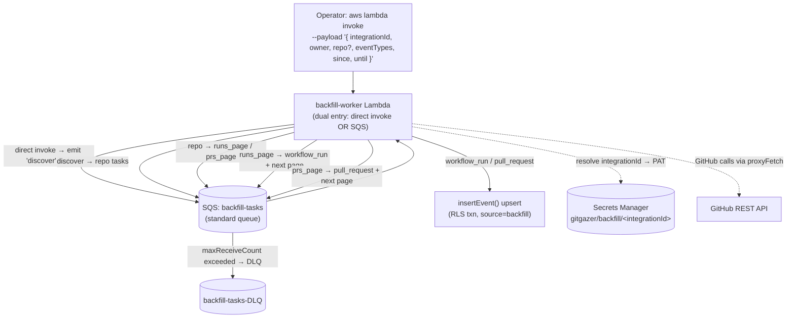

# Serverless Backfill: Run Historical Imports in AWS

## Status

Proposed

## Context

Historical GitHub Actions / pull-request data is currently backfilled by a CLI in [`packages/import`](../packages/import/src/index.ts) that runs **on a developer's local machine** (`pnpm run backfill`). The process is long-running and fragile against the operator's environment: if Wi-Fi drops, a VPN reconnects, or the host goes to sleep mid-run, the import is interrupted. Recent hardening added retry/backoff to the CLI ([`packages/import/src/http.ts`](../packages/import/src/http.ts)), but the fundamental problem remains — **the work is tied to a laptop that can disappear at any time.**

The goal is to move backfill into AWS so it runs serverless, retries transient failures automatically, and resumes where it left off — with no dependency on the operator staying online.

### Why this is a small step, not greenfield

The codebase already contains every pattern this design needs:

| Existing capability                                | Where                                                                                                                                                                   | Reused for backfill                                 |
| -------------------------------------------------- | ----------------------------------------------------------------------------------------------------------------------------------------------------------------------- | --------------------------------------------------- |
| SQS + worker Lambda with DLQ + partial-batch retry | [`infra/sqs_webhook_queue.tf`](../infra/sqs_webhook_queue.tf), [`infra/worker_lambda.tf`](../infra/worker_lambda.tf), [`worker.ts`](../apps/api/src/handlers/worker.ts) | New standard queue + worker, same shape             |
| Discover → enqueue → fan-out                       | [`org-sync-scheduler.ts`](../apps/api/src/handlers/org-sync-scheduler.ts) enqueues one task per installation                                                            | `discover` task enqueues one task per repo          |
| Idempotent, backfill-aware ingestion               | [`insertEvent()`](../apps/api/src/domains/webhooks/importers/index.ts), freshness guards in [`shared.ts`](../apps/api/src/domains/webhooks/importers/shared.ts#L243)    | Worker writes straight to DB, skips side effects    |
| Discriminated-union task routing                   | [`batch-processor.ts`](../apps/api/src/domains/webhooks/worker/batch-processor.ts#L20) routes `WebhookMessage \| OrgMemberSyncTask`                                     | Router adds backfill task kinds                     |
| GitHub paginators + webhook-shaped transforms      | [`packages/import/src/github.ts`](../packages/import/src/github.ts), [`transform.ts`](../packages/import/src/transform.ts)                                              | Lifted into `apps/api`, auth swapped to a PAT param |
| In-VPC egress to GitHub                            | [`proxy-fetch.ts`](../apps/api/src/shared/clients/proxy-fetch.ts) → http-proxy Lambda                                                                                   | Worker uses the same proxy path                     |

### Decisions (locked)

- **Trigger:** manual `aws lambda invoke` with a JSON payload (one-off). No API route or UI in this iteration.
- **GitHub auth:** a **personal access token (PAT) per integration**, stored in AWS Secrets Manager. (The backend GitHub-App auth path was considered but not all integrations are guaranteed to have an installation.)
- **Scope of this document:** design only. No code is written yet.

---

## Design

### High-Level Flow



### One Lambda, two trigger types

A single `backfill-worker` Lambda handles both entry modes:

- **Direct invoke** (no `Records` in the event): the JSON payload is treated as the initial `discover` task and pushed onto the queue. This is how an operator starts a run.
- **SQS invoke** (has `Records`): each record is a task, processed in batches with `function_response_types = ["ReportBatchItemFailures"]` — identical to [`worker.ts`](../apps/api/src/handlers/worker.ts). Failed tasks are retried by SQS, then parked in the DLQ.

This keeps the infrastructure footprint to **one Lambda + one queue + one DLQ**, which suits the one-off manual workflow.

### Task contract (chained pagination = bounded invocations)

Tasks are JSON bodies on a standard queue, modeled as a discriminated union (mirroring the existing `WebhookMessage | OrgMemberSyncTask` routing):

| Task `kind`       | Work performed                                             | Fan-out it emits                                                     |
| ----------------- | ---------------------------------------------------------- | -------------------------------------------------------------------- |
| `discover`        | List repos for `owner` (or single `repo`, or topic filter) | one `repo` task per repository                                       |
| `repo`            | Seed pagination for a repo                                 | `runs_page{page:1}` and/or `prs_page{page:1}`                        |
| `runs_page{page}` | Fetch **one** page of workflow runs                        | a `workflow_run` task per run + `runs_page{page+1}` if page full     |
| `prs_page{page}`  | Fetch **one** page of pull requests                        | a `pull_request` task per PR + `prs_page{page+1}` if page full       |
| `workflow_run`    | Fetch jobs, transform                                      | `insertEvent('workflow_run')` + `insertEvent('workflow_job')`        |
| `pull_request`    | Fetch PR detail + reviews, transform                       | `insertEvent('pull_request')` + `insertEvent('pull_request_review')` |

Every task carries the run context: `integrationId`, `owner`, `repo`, `eventTypes`, and optional `since` / `until`.

**Why chained pagination matters:** each task processes at most **one API page or one entity**, so no single invocation can run long enough to hit the Lambda timeout. Each unit retries independently via SQS, and the whole run resumes automatically after any transient failure — directly eliminating the Wi-Fi/sleep fragility of the local CLI.

Example task shapes:

```jsonc
// Initial direct-invoke payload (becomes the 'discover' task)
{ "kind": "discover", "integrationId": "…", "owner": "acme",
  "eventTypes": ["workflow_run", "workflow_job", "pull_request", "pull_request_review"],
  "since": "2025-01-01", "until": "2025-12-31" }

// Emitted per repository
{ "kind": "runs_page", "integrationId": "…", "owner": "acme", "repo": "web", "page": 1,
  "createdFilter": "2025-01-01..2025-12-31" }

// Emitted per workflow run
{ "kind": "workflow_run", "integrationId": "…", "owner": "acme", "repo": "web", "runId": 123456 }
```

### Idempotency & safety

Re-running a backfill (or retrying an individual task) is safe: ingestion goes through the existing [`insertEvent()`](../apps/api/src/domains/webhooks/importers/index.ts) path whose upserts apply freshness guards (`upsertWorkflowRuns` / `upsertWorkflowJobs` return `stale=true` rather than clobbering newer rows). The worker sets `source = 'backfill'`, which the importer already honors to **skip WebSocket broadcasts and alerting** — see [`batch-processor.ts`](../apps/api/src/domains/webhooks/worker/batch-processor.ts#L38).

### PAT storage & resolution

- **One Secrets Manager secret per integration**, name-prefixed: `gitgazer/backfill/<integrationId>` (value = the PAT). The worker resolves `integrationId → secret → token` at runtime and passes the token into the lifted GitHub fetchers.
- IAM is scoped to the prefix `gitgazer/backfill/*` for least privilege.
- _Alternative considered:_ a single secret holding `{ "<integrationId>": "<pat>" }`. Fewer resources, but coarser IAM and manual JSON editing. **Per-integration is recommended.**
- **Refactor required:** [`getHeaders()` in `github.ts`](../packages/import/src/github.ts) currently reads `process.env.GITHUB_TOKEN`. The lifted version must accept the token as an argument instead of reading the environment.

### Queue, retries, scaling, IAM, networking

- **Standard SQS queue** (not FIFO). Backfill needs parallelism, not ordering — the freshness guards make out-of-order and duplicate arrivals safe. Model it on [`sqs_webhook_queue.tf`](../infra/sqs_webhook_queue.tf):
    - Visibility timeout ≥ 6× the worker timeout.
    - `maxReceiveCount` ≈ 3 → DLQ with 14-day retention.
- **Cap GitHub usage** with `scaling_config { maximum_concurrency = N }` (e.g. 3–5) on the event-source mapping. A PAT allows ~5k requests/hour plus secondary concurrency limits; the lifted `fetchWithRetry` rate-limit backoff handles the rest.
- **IAM** (copy [`worker_lambda.tf`](../infra/worker_lambda.tf)): SQS **consume and send** on the backfill queue (self-enqueue for fan-out), `secretsmanager:GetSecretValue` on `gitgazer/backfill/*` **and** the existing `lambda_config` secret (DB config), `kms:Decrypt`, `rds-db:connect`, VPC access, CloudWatch Logs. **No** WebSocket or alerting permissions — backfill skips those side effects.
- **Egress:** the worker runs in the VPC private subnets for RDS access, so outbound GitHub calls must go through the existing [`proxyFetch`](../apps/api/src/shared/clients/proxy-fetch.ts) → http-proxy Lambda path (the same route org-sync uses), not a raw in-VPC `fetch`.

### Build / packaging

- Add a tsup entry `backfill-worker: src/handlers/backfill-worker.ts` in [`tsup.config.ts`](../apps/api/tsup.config.ts).
- Add it to `buildZip` in [`apps/api/package.json`](../apps/api/package.json) → produces `gitgazer-backfill-worker.zip`. CI already `aws s3 sync`s the `tmp/` artifacts to the Lambda store bucket.
- New code lives under `apps/api/src/domains/backfill/` (lifted `github.ts` + `transform.ts`, the task router, the PAT resolver).
- [`packages/import`](../packages/import) remains as a local CLI fallback short-term; retire once the serverless path is proven.

---

## Implementation Plan

### Phase 1 — Shared logic

1. Lift `github.ts` paginators and `transform.ts` into `apps/api/src/domains/backfill/`.
2. Refactor GitHub fetchers to take a `token` parameter instead of `process.env.GITHUB_TOKEN`.
3. Route GitHub calls through `proxyFetch`.

### Phase 2 — Worker

1. Add `apps/api/src/handlers/backfill-worker.ts` (dual entry: direct-invoke vs SQS).
2. Add the task router + handlers for each `kind` in `apps/api/src/domains/backfill/`.
3. Add the PAT resolver (`integrationId` → Secrets Manager).
4. Reuse `insertEvent()` for DB writes with `source = 'backfill'`.

### Phase 3 — Infrastructure

1. `infra/backfill_queue.tf`: standard queue + DLQ + Lambda + IAM role/policy + event-source mapping (`maximum_concurrency`).
2. Declare the `gitgazer/backfill/*` secret prefix (and optionally a placeholder secret) in [`infra/secrets.tf`](../infra/secrets.tf).
3. Wire the tsup entry + `buildZip` line.

### Phase 4 — Validation

1. Unit-test the task router and PAT resolver (Vitest, AWS mocked).
2. Deploy to a workspace; `aws lambda invoke` against a single repo; confirm rows land and the DLQ stays empty.
3. Scale to org-wide; observe concurrency cap and rate-limit behavior.

---

## Files Added / Changed

| Action | Path                                                                                       |
| ------ | ------------------------------------------------------------------------------------------ |
| add    | `infra/backfill_queue.tf` (queue + DLQ + Lambda + IAM + event-source mapping)              |
| add    | `apps/api/src/handlers/backfill-worker.ts`                                                 |
| add    | `apps/api/src/domains/backfill/` (router, tasks, lifted fetchers/transforms, PAT resolver) |
| edit   | `apps/api/tsup.config.ts`, `apps/api/package.json` (build/zip entry)                       |
| edit   | `infra/secrets.tf` (declare the PAT secret prefix)                                         |

---

## Open Considerations

- **`since` / `until` semantics** carry over from the CLI: a `created` filter for workflow runs, an `updated` filter for pull requests.
- **Cost:** primarily NAT/proxy traffic + Lambda-seconds; negligible for occasional one-off runs.
- **Observability:** Powertools structured logging plus a final summary log per `discover` run. DLQ depth is the "something failed" signal — consider a CloudWatch alarm on it.
- **Future trigger upgrade:** the manual-invoke entry can later be fronted by an authenticated `POST /api/integrations/:id/backfill` route and a UI button without changing the worker.
- **Auth upgrade path:** if integrations gain guaranteed GitHub-App installations, the PAT resolver can be swapped for `getInstallationOctokit` with no change to the task contract.
